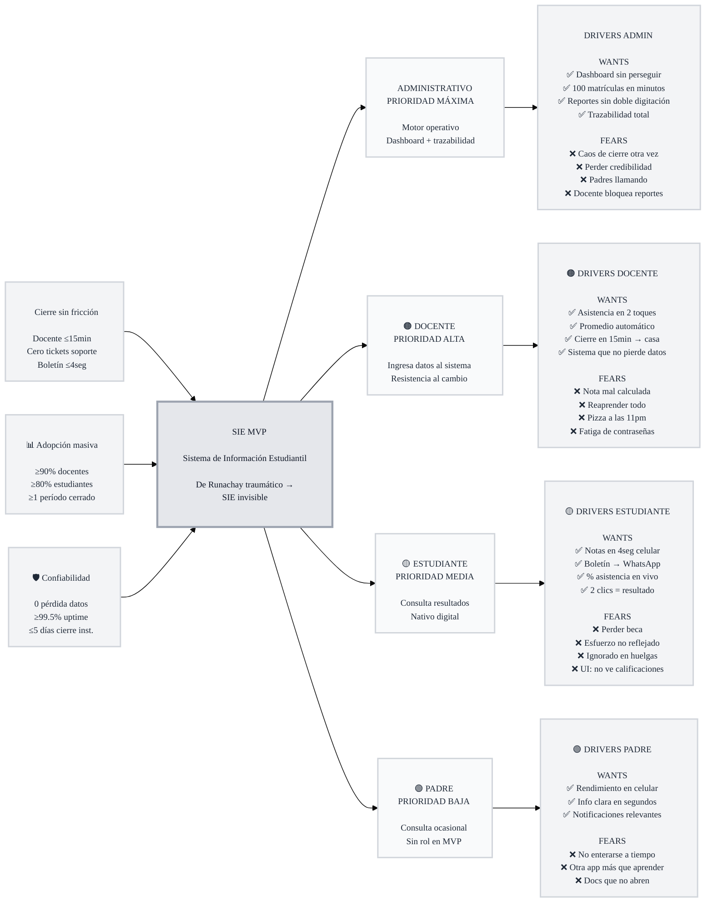

# Trigger Map: sis-mvp

> Visual overview connecting business goals to user psychology

**Created:** 2026-06-02
**Author:** Paul
**Methodology:** Based on Effect Mapping (Balic & Domingues), adapted for WDS framework

---

## Vision

Crear un Sistema de Información Estudiantil centrado en el usuario real — no en la burocracia del sistema — que permita a estudiantes ver sus calificaciones en segundos, a docentes registrar asistencia y notas sin fricción, y a padres consultar información sin perderse en menús laberínticos. Construido sobre una arquitectura modular preparada para escalar a múltiples instituciones, donde cada decisión de diseño responde a un dolor concreto reportado por los usuarios del sistema actual.

---

## Business Objectives

### Objective 1: Cierre de período sin fricción
- **Metric:** Tiempo de cierre por docente
- **Target:** ≤ 15 minutos (vs. horas con Runachay)
- **Timeline:** Primer período operativo

### Objective 2: Sistema invisible — cero fricción
- **Metric:** Tickets de soporte
- **Target:** 0 tickets en las últimas 3 semanas del período
- **Timeline:** Primer período operativo

### Objective 3: Acceso instantáneo a resultados
- **Metric:** Tiempo de consulta de boletín
- **Target:** ≤ 4 segundos desde notificación
- **Timeline:** Primer período operativo

### Objective 4: Adopción docente
- **Metric:** % de docentes activos usando el sistema
- **Target:** ≥ 90%
- **Timeline:** Primer período operativo

### Objective 5: Adopción estudiantil
- **Metric:** % de estudiantes consultando notas en sistema
- **Target:** ≥ 80%
- **Timeline:** Primer período operativo

### Objective 6: Operación end-to-end completada
- **Metric:** Períodos cerrados sin intervención manual del equipo técnico
- **Target:** ≥ 1 período cerrado limpiamente
- **Timeline:** Primer período operativo

### Objective 7: Cierre institucional ágil
- **Metric:** Tiempo desde fin de clases hasta publicación oficial
- **Target:** ≤ 5 días hábiles
- **Timeline:** Primer período operativo

### Objective 8: Cero pérdida de datos
- **Metric:** Incidentes con pérdida de notas o asistencias
- **Target:** 0
- **Timeline:** Continuo

### Objective 9: Disponibilidad
- **Metric:** Uptime durante horario lectivo (lun-sáb 07:00-22:00)
- **Target:** ≥ 99.5%
- **Timeline:** Continuo

---

## Target Groups (Prioritized)

### 1. Administrativo Académico — PRIORIDAD MÁXIMA 🔴

**Priority Reasoning:** Sin administrativos no hay período configurado, matrícula ni cierre. Son el motor operativo del sistema. Grupo pequeño, cautivo, desktop. Impacto: ALTO. Factibilidad: ALTA.

> *"No me pregunten a mí, pregúntenle al sistema"*

**Context:** Oficina, jornada completa. Corre de una tarea a otra: atender padres, procesar matrículas, perseguir docentes que no cierran notas.

**Key Positive Drivers:**
- Ver el estado de cada sección en un dashboard sin llamar a nadie
- Procesar 100 matrículas en minutos, no en horas
- Generar reportes para entes de control sin doble digitación
- Tener trazabilidad total: quién hizo qué y cuándo

**Key Negative Drivers:**
- Que el cierre de período sea otra vez un caos de planillas rotas y llamadas a las 10pm
- Que un error en el sistema le cueste su credibilidad ante la junta
- Que los padres sigan llamando por información que el sistema debería mostrar
- Que un docente no cierre y bloquee sus reportes otra vez

---

### 2. Docente — PRIORIDAD ALTA 🟠

**Priority Reasoning:** Métrica de éxito 90% depende de su adopción. Son quienes ingresan los datos al sistema. Pero hay resistencia al cambio en docentes mayores. Impacto: ALTO. Factibilidad: MEDIA.

> *"Solo quiero que el promedio me cuadre sin abrir Excel"*

**Context:** Aula + casa. Toma asistencia, evalúa, planifica clases. No es usuaria tecnológica avanzada, varias cerca del retiro.

**Key Positive Drivers:**
- Registrar asistencia con un par de toques, desde cualquier dispositivo
- Ver el promedio calculado automáticamente sin abrir Excel
- Cerrar el período en 15 minutos e irse a casa
- Confiar en que el sistema guardó todo correctamente

**Key Negative Drivers:**
- Que el cálculo de notas falle y una mamá llame indignada
- Tener que reaprender un sistema nuevo complicado
- Volver a las pizzas a las 11pm reconciliando notas entre cuadernos
- La fatiga de credenciales — contraseñas forzadas "a cada momento"

---

### 3. Estudiante — PRIORIDAD MEDIA 🟡

**Priority Reasoning:** Métrica 80%. Su experiencia es principalmente consulta. Nativos digitales, baja fricción. Impacto: MEDIO. Factibilidad: ALTA.

> *"Ya salieron — 4 segundos y mi mamá lo tiene en WhatsApp"*

**Context:** Celular, bus, casa. Quiere saber sus notas YA. Nativo digital pero con poca paciencia para sistemas mal diseñados.

**Key Positive Drivers:**
- Ver sus notas apenas se publican, en el celular, en segundos
- Descargar su boletín y compartirlo al instante
- Hacer seguimiento de su asistencia en tiempo real
- Navegar sin perderse — encontrar lo que busca en 2 clics

**Key Negative Drivers:**
- Perder una beca por no enterarse a tiempo de una calificación
- Que el sistema no refleje su esfuerzo real por un error de cálculo
- Enfrentar que el sistema lo ignore durante huelgas o paros nacionales
- La frustración de una UI donde "no me deja ver mis calificaciones"

---

### 4. Padre de Familia — PRIORIDAD BAJA 🟢

**Priority Reasoning:** Consumidor indirecto; sin rol propio en MVP. Impacta satisfacción pero no operación. Impacto: BAJO. Factibilidad: MEDIA.

> *"Quiero saber cómo va mi hijo sin tener que pedir permiso en el trabajo para ir a secretaría"*

**Context:** Celular, trabajo. Consulta ocasional. Quiere información clara, no perderse entre botones y texto.

**Key Positive Drivers:**
- Ver el rendimiento de su hijo desde el celular, sin ir a secretaría
- Entender la información en segundos, sin leer párrafos
- Recibir notificaciones cuando algo requiera su atención

**Key Negative Drivers:**
- No enterarse a tiempo de un problema académico de su hijo
- Tener que aprender "otra app más" con botones y texto por todas partes
- La impotencia de ver documentos que no abren ("se queda cargando")

---

## Trigger Map Visualization

---

## Design Focus Statement

> **El MVP debe hacer que el control administrativo sea inmediato y visible (dashboard, trazabilidad, operaciones masivas) y que el cierre de notas del docente sea tan rápido que se vuelva invisible — mientras el estudiante accede a sus resultados en segundos. Todo lo demás es secundario.**

**Primary Design Target:** Administrativo Académico

**Must Address:**
- Dashboard de estado de secciones sin llamar a nadie
- Cierre de notas en ≤15 minutos sin abrir Excel
- Acceso a calificaciones en ≤4 segundos desde notificación
- Trazabilidad total de quién hizo qué y cuándo
- Cálculo automático de promedios sin errores

**Should Address:**
- Acceso desde celular para consulta de estudiantes
- Notificaciones de publicación de boletines
- Interfaz sin "demasiados botones ni texto"
- Operaciones masivas (matrícula CSV)

---

## Cross-Group Patterns

### Shared Drivers
- **Miedo al error:** Admin teme perder credibilidad, Docente teme nota mal calculada, Estudiante teme perder beca — todos convergen en la necesidad de *confiabilidad del dato*
- **Fatiga de fricción:** Todos los grupos vienen de Runachay con experiencias traumáticas — el sistema debe ser lo *opuesto* a lo que conocen
- **Velocidad como valor:** Admin quiere procesar en minutos, Docente cerrar en 15min, Estudiante ver en 4seg — el tiempo ahorrado es el beneficio transversal

### Unique Drivers
- **Admin:** Trazabilidad y control (dashboard) — único rol que supervisa todo el sistema
- **Docente:** Autonomía de cátedra (definir esquema de evaluación) — único rol que configura reglas académicas
- **Estudiante:** Inmediatez social (compartir boletín por WhatsApp) — único rol que consume y difunde resultados

### Potential Tensions
- **Admin vs Docente:** El admin necesita que todos los docentes cierren para generar reportes institucionales, pero el docente valora autonomía y puede retrasar el cierre. La solución debe balancear visibilidad administrativa con respeto al ritmo del docente (recordatorios, no persecución).

---

## Gap Analysis

| Gap | Status | Action |
|-----|--------|--------|
| Perfil administrativo inferido sin entrevistas directas | Documentado como supuesto | Validar con el colegio en primera iteración |
| Condición "pedagogía propietaria" como justificación build vs buy | Hipótesis | Confirmar con la junta de accionistas |
| Checklist legal sin revisión de abogado | Pendiente | Revisión jurídica antes de producción |
| Sin medición real de tiempos actuales (baseline) | Pendiente | Medir durante período de transición |

---

## Next Steps

- [ ] **Validar con usuarios reales** — Contrastar los drivers inferidos con entrevistas a administrativos y docentes del colegio
- [ ] **Validación legal** — Revisar checklist de cumplimiento LOPDP/LOEI con abogado
- [ ] **UX Design (Fase 3)** — Usar este Trigger Map como base para diseñar pantallas priorizadas
- [ ] **Priorizar features** — Cada user story debe responder a un driver específico de este mapa
- [ ] **Actualizar con aprendizajes** — Este es un documento vivo; cada hallazgo lo refina

---

_Generated with WDS framework v6_
_Trigger Mapping methodology credits: Effect Mapping by Mijo Balic & Ingrid Domingues (inUse), adapted with negative driving forces_
